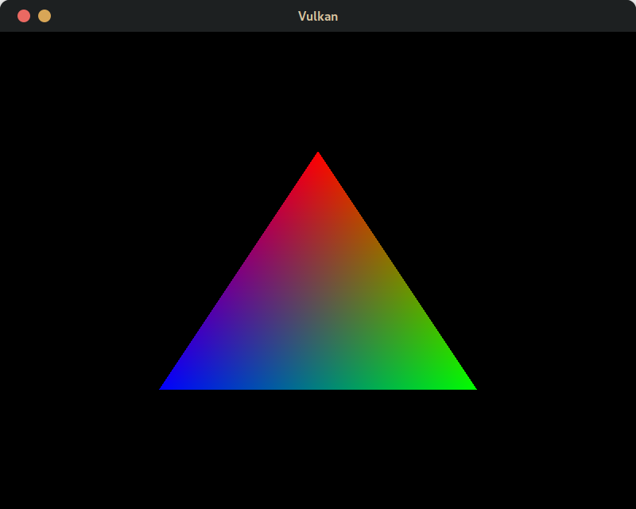

# UnderstandingCPP
Learning CPP and many libraries and coding techniques I might need. This not only includes cpp but everything else I need to learn and might need, mostly distributed in separate branches

# Vulkan Test

Finally Managed to get a triangle on screen !!!

