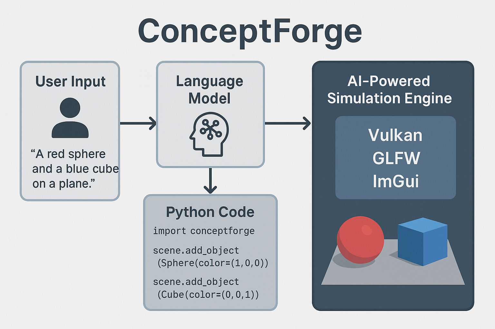

# ConceptForge

> "Describe your world in English. Let the AI bring it to life."

**ConceptForge** is an AI-powered simulation engine built from scratch using **Vulkan**, **C++**, **Python**, and **Large Language Models**. The vision is simple: write your scene in plain English, and watch it come to life in an interactive 3D simulation.

This project is part game engine, part AI assistant, and part creative tool — made for developers, researchers, and tinkerers who want to create, simulate, and prototype without limits.

---

## What Can It Do?

- Build and simulate 3D environments from natural language
- Expose engine APIs to Python for high-level scripting
- Render scenes in real time using Vulkan (including ray tracing down the line)
- Integrate with LLMs to generate Python code from user prompts
- Simulate physics, AI agents, procedural content — and more

---

## High-Level Overview



---

## Tech Stack

| Layer               | Stack                |
|---------------------|----------------------|
| Rendering           | Vulkan + GLFW        |
| UI                  | ImGui                |
| Language Bindings   | pybind11             |
| Scripting           | Python               |
| AI                  | LLM (GPT/local)      |
| Core Engine         | C++                  |

---

## Milestones

| Milestone                                         | Status     | Notes / Branch             |
|--------------------------------------------------|------------|-----------------------------|
| Draw a triangle on screen using Vulkan           | ✅ Done     | `main`                      |
| Integrate ImGui into the Vulkan pipeline         | ✅ Done     | `imgui-integration`         |
| Create basic ECS system for scene entities       | 🔜 Planned  |                             |
| Add camera + scene graph                         | 🔜 Planned  |                             |
| Enable user scripting via Python (pybind11)      | 🔜 Planned  |                             |
| Integrate LLM for prompt-to-script generation    | 🔜 Planned  |                             |
| Add basic physics (gravity, collision)           | 🔜 Planned  |                             |
| Build a demo: *"Drop a ball on a platform"*      | 🔜 Planned  |                             |
| Add custom ray tracing pipeline                  | 🔜 Planned  |                             |
| Launch a visual editor using ImGui               | 🔜 Planned  |                             |
| Package and release public demo                  | 🔜 Planned  |                             |

---

## Getting Started

> ⚠️ This project is under active development. Expect dragons. 🐉

### Prerequisites

- C++17 compatible compiler
- Vulkan SDK
- CMake ≥ 3.28
- Python 3.10+
- (Optional) OpenAI API key or local LLM model

### Build Instructions (Coming Soon)

> For now, the building process has only been tested on arch linux.

```sh
git clone https://github.com/kshitijaucharmal/ConceptForge
cd ConceptForge
make build # Compile
make # Run
```

---

## Project Structure (Planned)

```
ConceptForge/
├── engine/             # C++ core engine
├── external/           # Any extra Libaries required
├── scripts/            # Python interface and examples
├── bindings/           # pybind11 C++<->Python bridge
├── shaders/            # GLSL or SPIR-V shaders
├── gui/                # ImGui-based tooling
├── examples/           # Demo scripts and scenes
├── assets/             # Models, textures, and more
├── CMakeLists.txt      # cmake to manage dependencies and build
└── README.md
```

---

## Contributing

If you're into Vulkan, ECS, ImGui tools, or AI agents — and especially if you love weird ambitious projects — feel free to fork the repo, open issues, or submit PRs!

---

## Follow the Project

- 🌐 Blog: [My Dev Blog](https://kshitijaucharmal.github.io/blog)
- 🔗 GitHub: [https://github.com/kshitijaucharmal/ConceptForge](https://github.com/kshitijaucharmal/ConceptForge)

---

<!-- ## ⭐ Credits / Inspiration (Gonna add more here) -->
<!---->
<!-- - [pybind11](https://github.com/pybind/pybind11) -->
<!-- - Everyone in the open-source and AI tooling community 🧙‍♂️ -->

---

## License

MIT — use it, hack it, build your own universe with it.

---

> *“Simulation is the playground of imagination. Let’s build the tools that make dreams tangible.”*
